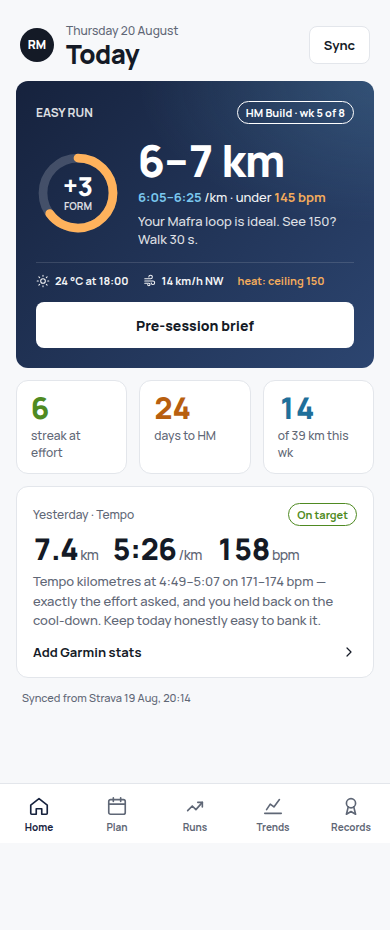
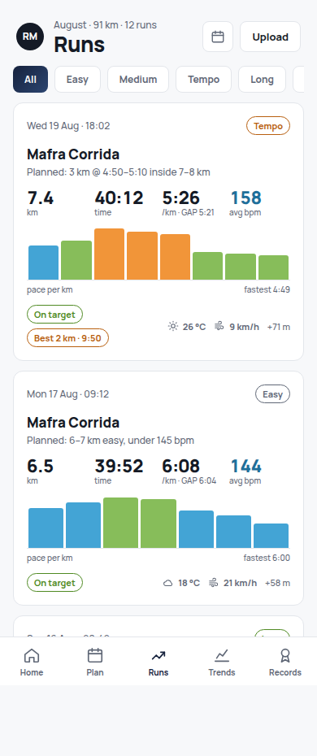
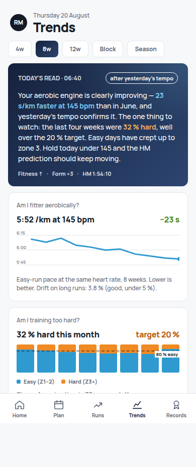

# Ritmo

> Your running, planned and explained. Strava-synced training log with a built-in AI coach.

[](https://github.com/rjmacp/ritmo/actions/workflows/ci.yml)


[](LICENSE)

Ritmo syncs every run from Strava, computes the metrics free apps hide (fitness/fatigue/form, pace at easy HR, grade-adjusted pace, intensity balance) and uses Claude to plan training blocks, brief each session and review progress — with a coach persona that is honest, encouraging, and insists on running easy days easy.

Design mockups (Stage 1 ships Runs and Account; Home/Trends arrive in later stages):

| Home                           | Runs                           | Trends                             |
| ------------------------------ | ------------------------------ | ---------------------------------- |
|  |  |  |

## Status

Stage 1 — Ingest: complete (auth, Strava sync, Runs feed, Run detail, PWA manifest, CI, Playwright smoke). See [build stages](docs/superpowers/specs/2026-08-20-ritmo-design.md#11-build-stages) and the [deployment runbook](docs/runbook.md).

## Stack

Next.js 15 (App Router) · TypeScript · Tailwind v4 · Drizzle ORM · Neon Postgres · Auth.js · Vitest + Playwright · Vercel

## Getting started

```bash
git clone https://github.com/rjmacp/ritmo && cd ritmo
npm ci
cp .env.example .env.local      # fill in Neon, Resend, Strava, secrets
npm run db:migrate
npm run dev
```

Then sign in with `ALLOWED_EMAIL`, open **Account → Connect Strava**. Full setup (Strava app, webhook subscription, Vercel) is in [docs/runbook.md](docs/runbook.md).

The app is installable as a PWA (`public/manifest.webmanifest`); the icons under `public/icons` are a solid-navy placeholder pending a real mark.

## Architecture

```
Strava ──webhook/cron/import──▶ lib/strava/normalise ──▶ lib/pipeline/processActivity ──▶ Neon (Drizzle)
                                                                                               │
                                                      app/(app)/runs  ◀── server components ──┘
```

- `lib/strava` — API client, OAuth, webhook verification, normalisation
- `lib/pipeline` — the single ingest path every source uses
- `lib/metrics` — pure, framework-free metric functions
- `lib/db` — schema, migrations, queries
- `app` — routes and screens; `components` — UI

Design spec: [docs/superpowers/specs/2026-08-20-ritmo-design.md](docs/superpowers/specs/2026-08-20-ritmo-design.md) · Screens: [`design/midnight`](design/midnight)

## Scripts

| Command                                       | What it does                                           |
| --------------------------------------------- | ------------------------------------------------------ |
| `npm run dev` / `build` / `start`             | Next.js                                                |
| `npm test` · `npm run e2e`                    | Vitest (unit + PGlite integration) · Playwright smoke  |
| `npm run lint` · `typecheck` · `format:check` | Quality gates (also run in CI and pre-commit)          |
| `npm run db:generate` · `db:migrate`          | Drizzle migrations (`db:migrate:prod` guards previews) |
| `npm run strava:subscribe`                    | One-time webhook subscription                          |

## Contributing

See [CONTRIBUTING.md](CONTRIBUTING.md). Security issues: [SECURITY.md](SECURITY.md).

## Licence

MIT © Rob MacPherson. Powered by Strava.
